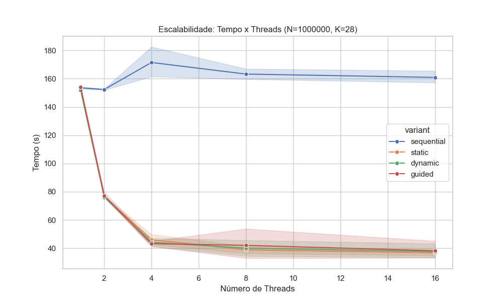
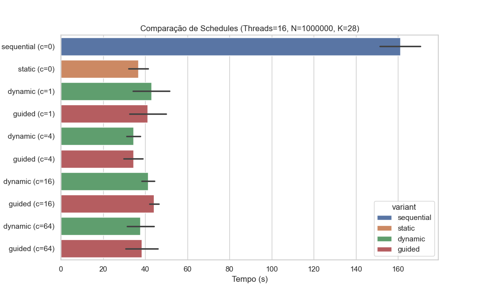
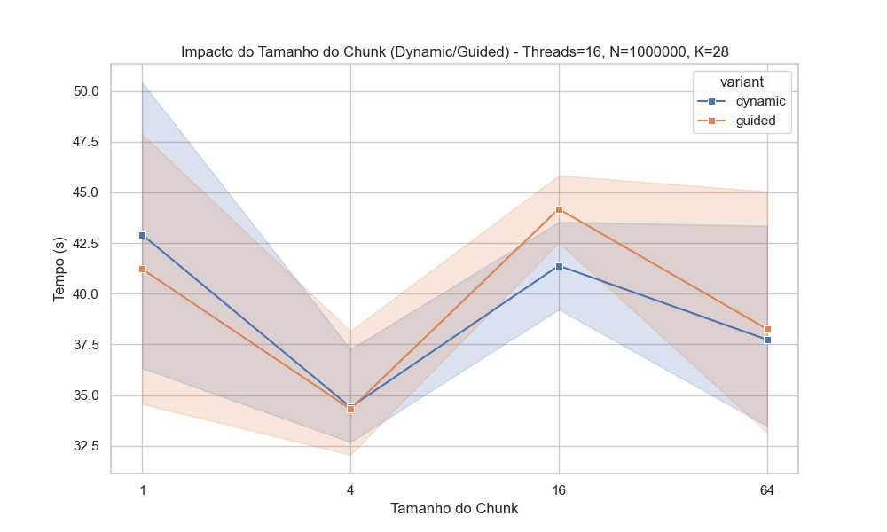

# Resultados - Tarefa A - Fibonacci

## Informações:
- **N (Tamanho do Vetor):** Quantas vezes o loop vai rodar.
- **K (Custo/Irregularidade):** Define o quão "pesado" é o cálculo fib(i % K).
- **Schedules**
    - **Static:** (N iterações) em fatias iguais no início. Baixo overhead, mas se alguém pegar uma fatia "mais longa", os outros ficam esperando.
    - **Dynamic:** As threads pegam chunks sob demanda. Tem alto overhead.
    - **Guided:** Começa com fatias grandes e diminui. Tenta equilibrar os dois anteriores.

- **Cada ponto nos gráficos representa a média de 5 execuções.**

## Análise de Escalabilidade
Avaliamos o impacto do aumento de threads para o caso mais custoso ($N=1.000.000, K=28$).

| Configuração | Tempo Médio (s) | Speedup |
|--------------|-----------------|---------|
| Sequencial   | 153.1s          | 1.0x    |
| 16 Threads   | 32.4s           | 4.7x    |

**Conclusão:** O algoritmo escala, reduzindo drasticamente o tempo de execução. O ganho não é perfeitamente linear devido ao overhead de gerenciamento das threads e limitações físicas dos núcleos da CPU.

## Comparação de Políticas de Escalonamento (Schedules)
Comparativo para $N=1.000.000, K=28$ com 16 Threads.

| Schedule | Chunk | Tempo (s) | Análise |
|----------|-------|-----------|---------|
| **Static** | Auto  | **32.4s** | **Melhor Desempenho.** Baixo overhead e boa distribuição de carga devido. |
| Dynamic  | 1     | 39.9s     | Pior desempenho devido ao alto overhead de solicitar tarefas unitárias constantemente. |
| Guided   | 1     | 42.1s     | Desempenho intermediário/baixo, overhead inicial impacta. |

**Decisão:** Para este problema específico, onde a carga de trabalho pesada (`fib(28)`) se repete periodicamente, o escalonamento **Static** é a melhor escolha. O `Dynamic` adiciona custo de sincronização desnecessário, pois a carga já se encontra balanceada probabilisticamente em vetores grandes.

## Impacto do Chunk Size
Variando o chunk no escalonamento Dynamic ($N=1.000.000, K=28$).

- **Chunk 1:** ~39.9s (Maior overhead)
- **Chunk 64:** ~39.4s (Menor overhead)

**Conclusão:** Observou-se uma anomalia de desempenho com chunk=16 no schedule Dynamic, que apresentou o pior tempo (~43.6s), superando até mesmo o overhead excessivo do chunk=1. O tamanho 16 causou uma distribuição desigual onde certas tarefas concentraram desproporcionalmente os cálculos pesados, anulando o benefício do balanceamento dinâmico

# Resultados - Tarefa B - Histograma (Sincronização)

## Informações:
- **N (Tamanho do Vetor):** Quantidade de elementos a serem classificados no histograma.
- **B (Número de Buckets):** Quantidade de "cestos" onde os números serão contados. Define a chance de colisão (duas threads tentando escrever no mesmo lugar).

- **Variantes de Implementação:**

    - **V1 (Critical):** Uso de trava global. Apenas uma thread escreve por vez. Segurança máxima, desempenho mínimo.
    - **V2 (Atomic):** Uso de instruções de hardware (lock add). Rápido, mas sofre com contenção de cache se muitas threads disputarem o mesmo bucket.

    - **V3 (Local/Reduction):** Cada thread tem seu histograma privado. Elimina contenção durante o loop, mas gasta memória extra e tempo para somar (redução) no final.

    Cada ponto nos gráficos representa a média de 5 execuções.

## Análise de Escalabilidade
Avaliamos o impacto do aumento de threads para o cenário N=100.000,B=32.

| Configuração | Tempo Médio (ms) | Speedup |
|--------------|------------------|---------|
| Sequencial (Local 1T) | ~0.45 ms | 1.0x |
| 16 Threads | ~0.80 ms | 0.56x (Slowdown) |

**Conclusão:** Não houve speedup (aceleração); pelo contrário, houve degradação de desempenho. Isso ocorre devido à Granularidade Fina. O vetor de 100.000 inteiros é processado tão rapidamente pela CPU (frações de milissegundo) que o overhead (custo fixo) de criar, gerenciar e sincronizar as 16 threads é maior do que o tempo economizado dividindo o trabalho. O problema é pequeno demais para justificar o paralelismo.

## Comparação de Estratégias de Sincronização
Comparativo para N=100.000,B=32 com 16 Threads.

| Variante | Tempo (ms) | Análise |
|----------|------------|---------|
| Critical | ~500 ms | Pior Desempenho. Serialização total. As threads passam mais tempo esperando na fila do bloqueio do que trabalhando. |
| Atomic | ~2.5 ms | Desempenho razoável, mas prejudicado pelo B=32 (poucos buckets), causando alta disputa de cache (cache thrashing) no mesmo endereço de memória. |
| Local | ~0.8 ms | Melhor Desempenho Relativo. Evita contenção, mas ainda sofre com o overhead de malloc/free repetido para cada thread num problema pequeno. |

**Decisão:** A estratégia Local (V3) é arquiteturalmente superior pois elimina a condição de corrida durante o processamento pesado. A estratégia Critical (V1) provou-se inviável para computação de alto desempenho.

## Análise de "Overhead" e Tamanho do Problema

Analisando a relação entre o tempo de cálculo real (Kernel) e o tempo total de execução.
    - **Tempo de Kernel (Cálculo):** Diminui ligeiramente ou se mantém estável.
    - **Tempo de Overhead (Setup):** Cresce linearmente com o número de threads.

**Conclusão**: A Lei de Amdahl impõe um limite severo aqui. Para N=100.000, a parte sequencial do programa (alocação de memória, leitura de dados e criação de threads) domina o tempo total. O paralelismo só traria benefícios reais (Speedup > 1) se aumentássemos a carga de trabalho drasticamente (ex: N=100.000.000), onde o tempo de processamento superaria o custo de gerenciamento das threads.
